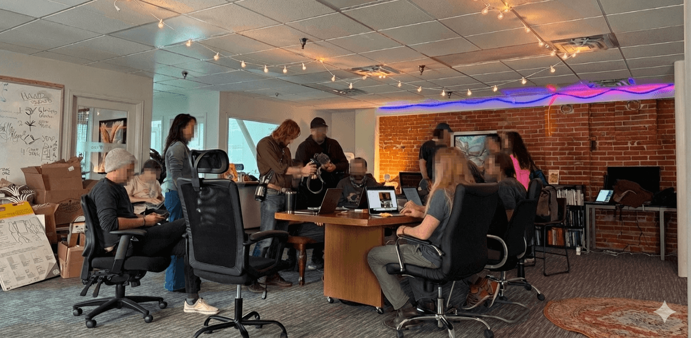

### ethereumlocalism.xyz

## Why Contributions Matter

The Knowledge Garden thrives on community input. Every contribution strengthens the movement by helping root it deeper in place:

- **The garden grows with you.** This is a living, growing resource. Field Reports, definitions, and initiatives add to a shared understanding that others can build on.
- **Real-world evidence matters.** Stories from Portland, Boulder, Taipei, Rome, and beyond help show what works. Your experiment might inspire another community needs to get started.
- **Localism is anticapture.** From the [GFEL 2023 announcement](library/GFEL/GFEL-Announcement-2023): every site of novel local use is a potential inoculation site against capture. Documenting and sharing helps others seed the same and more.

---
## How to Contribute

### About

Our knowledge garden is a [markdown-based](https://www.markdownguide.org/cheat-sheet/) wiki. We generally use [Obsidian](https://obsidian.md/) to create and curate documents.

To contribute to this knowledge garden, you have two options: share resources with existing curators, or become a curator yourself. Browse the [Library](/knowledge-garden/library), [Field Reports](/knowledge-garden/library/Field-Reports), and [Shared Definitions](/knowledge-garden/library/Shared-Definitions) to see the kinds of content we host. Once you've reached out we may ask for additional information or respond with some editorial comments, or we may post directly.

Listings are reviewed by curators before going live.

---
### Option 1: Share Resources

If you have a resource you’d like to submit but don’t want to join the GitHub repo, you can share a Google Doc or markdown file (please include the required metadata, noted in the "Authoring Content" section below) with one of the curators - email:

- **christypdx & exeunt:** [etherealforest.eth@protonmail.com](mailto:etherealforest.eth@protonmail.com)
- **Clinamenic:** [ssc@clinamenic.com](mailto:ssc@clinamenic.com)

---
### Option 2: Join the Repo

1. Download [Obsidian](https://obsidian.md/download), a Markdown editor we use for authoring.
2. Clone the [ethereum-localism repository](https://github.com/ethereumlocalism/ethereum-localism) (or the current project repo).
3. Open the `/content` folder in Obsidian as a vault.
4. Request GitHub access to push updates.
5. Create a pull request from `your-branch-name` to `main`.
6. Once accepted, your content will go live on the site.

---
## Authoring Content

### Licensing
Knowledge Garden publications by default will be licensed under CC BY-SA 4.0. Alternative licensing can be specified via metadata (see below). [About CC Licenses](https://creativecommons.org/share-your-work/cclicenses/)

### Metadata (Frontmatter)

Each Markdown file should begin with a metadata section that includes at least the minimum required information shared below. This helps categorize and sort content throughout the site. Additional metadata can be included at the submitter's discretion, examples below.

Here’s a full example:

```markdown
---
title: "Community Currencies in Chiapas"
date: 2024-11-12
author: "Sofia Martínez"
tags:  - format/case-study  - place/rural  - theme/community-currency
---
```

### Metadata Field Reference

**Required**
- `title`: The title of your piece
- `date`: Submission or publication date (`YYYY-MM-DD`)
- `author`: Your name or author name(s)
- `tags`: A list of lowercase keywords to help with categorization. Tags power discovery: they appear on note cards and in the Popular Tags sidebar, and each tag links to a filtered view of all notes with that tag.
	- [View the Tag Index](/knowledge-garden/tag-index) for the full taxonomy and usage guidance.

**Optional**
- `authorURL`: URL of the author
- `source`: Original source of the publication
- `language`: Language of the publication
- `license`: License of the publication

---
### Markdown Cheatsheet

Use standard [Markdown formatting](https://www.markdownguide.org/cheat-sheet/) to write your content. Obsidian provides helpful shortcuts, but any text editor will work.

---
### Content Architecture

Content in the Knowledge Garden is organized as follows:

### Library

The Library is organized by thematic categories, each with a landing page and its own subfolder. Add or edit Markdown articles in the appropriate category folder:

- **Field Reports** (`library/Field Reports/`) – Real-world case studies and narratives from experimentation and implementation
- **Implementation Guides** (`library/Implementation Guides/`) – How-to guides for implementing Ethereum Localist principles and toolkits
- **GFEL** (`library/GFEL/`) – Documentation from General Forums on Ethereum Localism
- **Ethereum Localism** (`library/Ethereum Localism/`) – Articles and theory on the Ethereum Localism thesis
- **Extitutions and Open Protocols** (`library/Extitutions and Open Protocols/`) – Research and theory on protocols beyond institutional enclosures
- **Local DAO Summer** (`library/Local DAO Summer/`) – Documentation from Local DAO Summer gatherings

Additional sections include Movement Signals, Community Digital Garden, and more. Propose new categories as the garden grows.

### Resources

The Resources page is a curated directory of external tools, platforms, and communities—links to sites across the ecosystem (e.g. Regen Foundation, Gitcoin, DAOhaus). It also includes the **Ethereum Localism Registry**, where initiatives and communities can be listed, and the **Gallery** for cultural outputs. To add an external resource or register your initiative, reach out to the curators.

### Featured content (curator-only)

The rotating "Featured Resource" carousel on the homepage is strictly curator-managed. Contributors cannot self-feature. Curators add items via `content/featured-resources/` or by setting `featured: true` on existing content. There is no public submission path.

---
## Support

**Join the conversation.** Connect with other Ethereum Localists in our [Telegram chat](https://t.me/+5Enk4J4d98MyMDkx).

**Questions or other ways to help?** Reach out to the curators at the emails above, or share your idea in Telegram. Whether you're exploring local initiatives, hosting events, or want to support the movement in another way—we'd love to hear from you.

---

